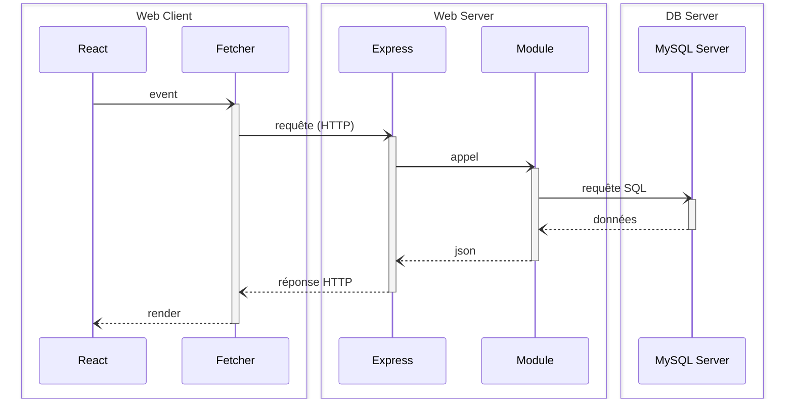

# p3

Ce projet est un monorepo JS, suivant l'architecture React-Express-MySQL telle qu'enseignée à la Wild Code School (v7.2.4) :

# External Ship

**External Ship** est un site web fictif de location de vaisseaux spatiaux. Il simule un véritable service de réservation destiné à des **particuliers** ou des **entreprises** souhaitant voyager dans l’espace.

Ce projet a été développé dans le cadre d’une formation web afin de mettre en pratique un ensemble de compétences **fullstack** (front + back).

---

## Objectifs fonctionnels

### Utilisateur
- Parcours et visualisation de la flotte disponible
- Consultation des fiches détaillées des vaisseaux
- Connexion à un espace personnel sécurisé
- Possibilité de louer un vaisseau (fonctionnalité à venir)

### Entreprise
- Connexion à un espace dédié
- Ajout de nouveaux vaisseaux
- Gestion de ses propres vaisseaux

### Administrateur
- Accès à une interface d’administration complète
- Ajout et suppression de n’importe quel vaisseau
- Lecture de tous les utilisateurs et entreprises inscrits
- Supervision générale du système

---

## Stack technique

### Frontend (client)
- **React** + **TypeScript** : interface moderne, typée et dynamique
- **React Router** : gestion des routes côté client
- **Fetch API** : appels HTTP vers l’API

### Backend (serveur)
- **Express.js (Node.js)** : création de l’API REST
- **TypeScript** : typage fort côté serveur
- **JWT** : authentification sécurisée avec JSON Web Tokens
- **argon2** : hachage des mots de passe
- **cookie httpOnly** : stockage sécurisé du token côté serveur

### Base de données
- **MySQL** : gestion des utilisateurs, des vaisseaux, etc.

---

## Outils & Environnement

- **dotenv** : gestion des variables d’environnement
- **Postman** : tests des routes de l’API
- **ESLint + Prettier** : qualité et cohérence du code
- **Git + GitHub** : versionnement et collaboration

## Stripe

L'application utilise **Stripe** pour la gestion des paiements via Stripe Checkout.

### Structure du projet

Le projet est organisé en deux parties distinctes :

### Dépendances Stripe

| Partie     | Bibliothèque                   | Commande d'installation                         |
|------------|--------------------------------|--------------------------------------------------|
| Frontend   | `@stripe/stripe-js`            | `cd client && npm install @stripe/stripe-js`     |
| Backend    | `stripe` (Stripe Node SDK)     | `cd server && npm install stripe`                |

### 📌 Remarques importantes

- Les dépendances **doivent être installées séparément** dans le client et le serveur.
- `@stripe/stripe-js` est utilisée uniquement dans le frontend pour gérer la redirection vers le checkout.
- `stripe` est utilisée uniquement côté serveur pour créer les sessions de paiement et gérer les webhooks.

### Webhooks Stripe en local

Pour écouter les webhooks en local via Stripe CLI :

```bash
stripe login
stripe listen --forward-to https://localhost:3310/webhook

### Ajouter au fichier .env coté server

STRIPE_SECRET_KEY=sk_test_...
STRIPE_WEBHOOK_SECRET=whsec_...
STRIPE_API_VERSION=2025-06-30

### Ajouter au fichier .env coté client

VITE_STRIPE_PUBLIC_KEY=pk_test_


## Fonctionnement général

- Le backend crée une session de paiement Stripe, en injectant dans la `metadata` les informations nécessaires (`shipId`, `userId`, etc.).
- Une fois le paiement validé, Stripe envoie un **webhook** à l’API pour confirmer la transaction et mettre à jour la base de données.

---



Il est pré-configuré avec un ensemble d'outils pour aider les étudiants à produire du code de qualité industrielle, tout en restant un outil pédagogique :

- **Concurrently** : Permet d'exécuter plusieurs commandes simultanément dans le même terminal.
- **Vite** : Alternative à _Create-React-App_, offrant une expérience plus fluide avec moins d'outils.
- **Biome** : Alternative à _ESlint_ et _Prettier_, assurant la qualité du code selon des règles choisies.
- **Supertest** : Bibliothèque pour tester les serveurs HTTP en node.js.

## Table des Matières

- [p3](#name)
  - [Table des Matières](#table-des-matières)
  - [Installation \& Utilisation](#installation--utilisation)
  - [Les choses à retenir](#les-choses-à-retenir)
    - [Commandes de Base](#commandes-de-base)
    - [Structure des Dossiers](#structure-des-dossiers)
    - [Mettre en place la base de données](#mettre-en-place-la-base-de-données)
    - [Développer la partie back-end](#développer-la-partie-back-end)
    - [REST](#rest)
    - [Autres Bonnes Pratiques](#autres-bonnes-pratiques)
  - [FAQ](#faq)
    - [Installation avec Docker](#installation-avec-docker)
      - [Mode développement](#mode-développement)
      - [Installation de nouvelles dépendances](#installation-de-nouvelles-dépendances)
      - [Accéder à la base de données](#accéder-à-la-base-de-données)
    - [Déploiement avec Traefik](#déploiement-avec-traefik)
    - [Variables d'environnement spécifiques](#variables-denvironnement-spécifiques)
    - [Logs](#logs)
    - [Contribution](#contribution)

## Installation & Utilisation

1. Installez le plugin **Biome** dans VSCode et configurez-le.
2. Clonez ce dépôt, puis accédez au répertoire cloné.
3. Exécutez la commande `npm install`.
4. Créez des fichiers d'environnement (`.env`) dans les répertoires `server` et `client` : vous pouvez copier les fichiers `.env.sample` comme modèles (**ne les supprimez pas**).

## Les choses à retenir

### Commandes de Base

| Commande               | Description                                                                 |
|------------------------|-----------------------------------------------------------------------------|
| `npm install`          | Installe les dépendances pour le client et le serveur                       |
| `npm run db:migrate`   | Met à jour la base de données à partir d'un schéma défini                   |
| `npm run dev`          | Démarre les deux serveurs (client et serveur) dans un seul terminal         |
| `npm run check`        | Exécute les outils de validation (linting et formatage)                     |
| `npm run test`         | Exécute les tests unitaires et d'intégration                                |

### Structure des Dossiers

```plaintext
 ── bin
    ├── clean.js
 ── client
     ── playwright─report
         ── data
            ├── 3662687c249008c2ab33b17ba0f801675658551c.zip
         ── trace
             ── assets
             ── codeMirrorModule.C3UTv─Ge.css
             ── codicon.DCmgc─ay.ttf
             ── defaultSettingsView.NYBT19Ch.css
             ── index.BjQ9je─p.js
             ── index.CFOW─Ezb.css
             ── index.html
             ── playwright─logo.svg
             ── snapshot.html
             ── sw.bundle.js
             ── uiMode.BatfzHMG.css
             ── uiMode.D5wwC2E1.js
             ── uiMode.html
            ├── xtermModule.Beg8tuEN.css
        ├── index.html
     ── src
         ── UI
            ├── UX
         ── assets
            ├── images
         ── components
             ── BetterUnderstand.css
             ── BetterUnderstand.tsx
             ── CreateUser.css
             ── Filter.css
             ── Filter.tsx
             ── Footer.css
             ── Footer.tsx
             ── Header.css
             ── Header.tsx
             ── LoginForm.css
             ── LoginForm.tsx
             ── LogoutButton.tsx
             ── NotAuth.tsx
             ── RentForm.css
             ── RentForm.tsx
             ── ShipCard.css
             ── ShipCard.tsx
             ── ShipForm.css
             ── ShipForm.tsx
            ├── createUser.tsx
         ── fonts
             ── monasans
            ├── supremespike
         ── pages
             ── AddShip.css
             ── AddShip.tsx
             ── Admin.tsx
             ── Connection.css
             ── Connection.tsx
             ── Home.css
             ── Home.tsx
             ── LocationReservation.css
             ── LocationReservation.tsx
             ── Modality.css
             ── Modality.tsx
             ── ShipDetails.css
             ── ShipDetails.tsx
             ── Ships.css
            ├── Ships.tsx
         ── services
         ── types
            ├── vite─env.d.ts
         ── App.css
         ── App.tsx
        ├── main.tsx
     ── test─results
        ├── header─Navigation─depuis─le─header─chromium
            ├── trace.zip
     ── tests
        ├── header.spec.ts
     ── index.html
     ── package.json
     ── playwright.config.ts
     ── tsconfig.json
     ── tsconfig.node.json
    ├── vite.config.ts
 ── server
     ── bin
         ── migrate.ts
        ├── seed.ts
     ── database
         ── fixtures
             ── AbstractSeeder.ts
             ── ItemSeeder.ts
            ├── UserSeeder.ts
         ── checkConnection.ts
         ── client.ts
        ├── schema.sql
     ── src
         ── middlewares
            ├── verifiyToken.ts
         ── modules
             ── auth
             ── ship
            ├── user
         ── types
            ├── express
         ── app.ts
         ── main.ts
        ├── router.ts
     ── tests
        ├── install.test.ts
     ── upload
         ── 1751460524450─7.jpg
         ── ship1.png
         ── ship2.png
         ── ship3.png
         ── ship4.png
         ── ship5.png
         ── ship6.png
         ── ship7.png
         ── ship8.png
        ├── ship9.png
     ── jest.config.js
     ── package.json
    ├── tsconfig.json
 ── Dockerfile
 ── LICENSE.md
 ── README.md
 ── biome.json
 ── commitlint.config.js
 ── database─setup.sh
 ── docker─compose.prod.yml
 ── docker─compose.yml
 ── package─lock.json
 ── package.json
├── structure.txt

```

### Mettre en place la base de données

**Créer et remplir le fichier `.env`** dans le dossier `server` :

```plaintext
DB_HOST=localhost
DB_PORT=3306
DB_USER=not_root
DB_PASSWORD=password
DB_NAME=my_database
```

**Les variables sont utilisés** dans `server/database/client.ts` :

```typescript
const { DB_HOST, DB_PORT, DB_USER, DB_PASSWORD, DB_NAME } = process.env;

import mysql from "mysql2/promise";

const client = mysql.createPool({
  host: DB_HOST,
  port: DB_PORT as number | undefined,
  user: DB_USER,
  password: DB_PASSWORD,
  database: DB_NAME,
});

export default client;
```

**Créer une table** dans `server/database/schema.sql` :

```sql
CREATE TABLE item (
  id INT AUTO_INCREMENT PRIMARY KEY,
  title VARCHAR(255) NOT NULL,
  user_id INT NOT NULL,
  FOREIGN KEY(user_id) REFERENCES user(id)
);
```

**Insérer des données** dans `server/database/schema.sql` :

```sql
INSERT INTO item (title, user_id) VALUES
  ('Sample Item 1', 1),
  ('Sample Item 2', 2);
```

**Synchroniser la BDD avec le schema** :

```sh
npm run db:migrate
```

### Développer la partie back-end

**Créer une route** dans `server/app/router.ts` :

```typescript
// ...

/* ************************************************************************* */
// Define Your API Routes Here
/* ************************************************************************* */

// Define item-related routes
import itemActions from "./modules/item/itemActions";

router.get("/api/items", itemActions.browse);

/* ************************************************************************* */

// ...
```

**Définir une action** dans `server/app/modules/item/itemActions.ts` :

```typescript
import type { RequestHandler } from "express";

import itemRepository from "./itemRepository";

const browse: RequestHandler = async (req, res, next) => {
  try {
    const items = await itemRepository.readAll();

    res.json(items);
  } catch (err) {
    next(err);
  }
};

export default { browse };
```

**Accéder aux données** dans `server/app/modules/item/itemRepository.ts` :

```typescript
import databaseClient from "../../../database/client";

import type { Result, Rows } from "../../../database/client";

interface Item {
  id: number;
  title: string;
  user_id: number;
}

class ItemRepository {
  async readAll() {
    const [rows] = await databaseClient.query<Rows>("select * from item");

    return rows as Item[];
  }
}

export default new ItemRepository();
```

**Ajouter un middleware** 

```typescript
// ...

/* ************************************************************************* */
// Define Your API Routes Here
/* ************************************************************************* */

// Define item-related routes
import itemActions from "./modules/item/itemActions";

const foo: RequestHandler = (req, res, next) => {
  req.message = "hello middleware";

  next();
}

router.get("/api/items", foo, itemActions.browse);

/* ************************************************************************* */

// ...
```

`req.message` sera disponible dans `itemActions.browse`.

⚠️ La propriété `message` doit être ajoutée dans `src/types/express/index.d.ts` :

```diff
// to make the file a module and avoid the TypeScript error
export type {};

declare global {
  namespace Express {
    export interface Request {
      /* ************************************************************************* */
      // Add your custom properties here, for example:
      //
      // user?: { ... };
      /* ************************************************************************* */
+      message: string;
    }
  }
}
```

### REST

| Opération | Méthode | Chemin d'URL | Corps de la requête | SQL    | Réponse (Succès)               | Réponse (Erreur)                                                       |
|-----------|---------|--------------|---------------------|--------|--------------------------------|------------------------------------------------------------------------|
| Browse    | GET     | /items       |                     | SELECT | 200 (OK), liste des items.     |                                                                        |
| Read      | GET     | /items/:id   |                     | SELECT | 200 (OK), un item.             | 404 (Not Found), si id invalide.                                       |
| Add       | POST    | /items       | Données de l'item   | INSERT | 201 (Created), id d'insertion. | 400 (Bad Request), si corps invalide.                                  |
| Edit      | PUT     | /items/:id   | Données de l'item   | UPDATE | 204 (No Content).              | 400 (Bad Request), si corps invalide. 404 (Not Found), si id invalide. |
| Destroy   | DELETE  | /items/:id   |                     | DELETE | 204 (No Content).              | 404 (Not Found), si id invalide.                                       |

### Autres Bonnes Pratiques

- **Sécurité** :
  - Validez et échappez toujours les entrées des utilisateurs.
  - Utilisez HTTPS pour toutes les communications réseau.
  - Stockez les mots de passe de manière sécurisée en utilisant des hash forts (ex : argon2).
  - Revoyez et mettez à jour régulièrement les dépendances.

- **Code** :
  - Suivez les principes SOLID pour une architecture de code propre et maintenable.
  - Utilisez TypeScript pour bénéficier de la vérification statique des types.
  - Adoptez un style de codage cohérent avec Biome.
  - Écrivez des tests pour toutes les fonctionnalités critiques.

## FAQ

### Installation avec Docker
> ⚠️ Prérequis : Vous devez avoir installé Docker et Docker Compose sur votre machine.  
> Suivez les instructions ici : [Docker Installation](https://docs.docker.com/get-docker/).

Lorsque Docker est installé et démarré, exécutez la commande suivante pour construire l'image Docker et démarrer les conteneurs :
```bash
docker compose up -d --build
```
La partie _client_ de l'application sera accessible à l'adresse http://localhost:3000 et la partie _serveur_ à l'adresse http://localhost:3310.  
Pour arrêter et supprimer les conteneurs, exécutez :
```bash
docker compose down
```

#### Mode développement
Les dépendances (du dossier `node_modules`) sont installées dans le conteneur Docker et ne seront pas visibles directement. Si vous utilisez un IDE comme VSCode et que vous souhaitez modifier des fichiers de votre application, vous devez installer les dépendances localement pour prévenir toute erreur de fichiers manquants.  
```bash
npm install
```

#### Installation de nouvelles dépendances
Pour installer de nouvelles dépendances, procédez en local comme d'habitude avec `npm install <package-name>`, puis, synchronisez les dépendances dans le conteneur Docker avec la commande suivante :
```bash
docker compose exec web sh -c "npm install"
```

#### Accéder à la base de données
Pour vous connecter à la base de données avec votre terminal, exécutez la commande suivante :
```bash
docker compose exec database sh -c "mysql -uuser -ppassword js_template_fullstack"
```

### Déploiement avec Traefik

> ⚠️ Prérequis : Vous devez avoir installé et configuré Traefik sur votre VPS au préalable. Suivez les instructions ici : [VPS Traefik Starter Kit](https://github.com/WildCodeSchool/vps-traefik-starter-kit/).

Pour le déploiement, ajoutez les secrets suivants dans la section `secrets` → `actions` du dépôt GitHub :

- `SSH_HOST` : Adresse IP de votre VPS
- `SSH_USER` : Identifiant SSH pour votre VPS
- `SSH_PASSWORD` : Mot de passe de connexion SSH pour votre VPS

Et une variable publique dans `/settings/variables/actions` :

- `PROJECT_NAME` : Le nom du projet utilisé pour créer le sous-domaine.

> ⚠️ Avertissement : Les underscores ne sont pas autorisés car ils peuvent causer des problèmes avec le certificat Let's Encrypt.

L'URL de votre projet sera `https://${PROJECT-NAME}.${subdomain}.wilders.dev/`.

### Variables d'environnement spécifiques

Les étudiants doivent utiliser le modèle fourni dans le fichier `*.env.sample*` en suivant la convention `<PROJECT_NAME><SPECIFIC_NAME>=<THE_VARIABLE>`.

> ⚠️ **Avertissement:** Le `PROJECT_NAME` doit correspondre à celui utilisé dans la variable publique Git.

Pour l'ajouter lors du déploiement, suivez ces deux étapes :

1. Ajoutez la variable correspondante dans le fichier `docker-compose.prod.yml` (comme montré dans l'exemple : `PROJECT_NAME_SPECIFIC_NAME: ${PROJECT_NAME_SPECIFIC_NAME}`).
2. Connectez-vous à votre serveur via SSH. Ouvrez le fichier `.env` global dans Traefik (`nano ./traefik/data/.env`). Ajoutez la variable avec la valeur correcte et sauvegardez le fichier.

Après cela, vous pouvez lancer le déploiement automatique. Docker ne sera pas rafraîchi pendant ce processus.

### Logs

Pour accéder aux logs de votre projet en ligne (pour suivre le déploiement ou surveiller les erreurs), connectez-vous à votre VPS (`ssh user@host`). Ensuite, allez dans votre projet spécifique et exécutez `docker compose logs -t -f`.

### Contribution

Nous accueillons avec plaisir les contributions ! Veuillez suivre ces étapes pour contribuer :

1. **Fork** le dépôt.
2. **Clone** votre fork sur votre machine locale.
3. Créez une nouvelle branche pour votre fonctionnalité ou bug fix (`git switch -c feature/your-feature-name`).
4. **Commit** vos modifications (`git commit -m 'Add some feature'`).
5. **Push** vers votre branche (`git push origin feature/your-feature-name`).
6. Créez une **Pull Request** sur le dépôt principal.

**Guide de Contribution** :

- Assurez-vous que votre code respecte les standards de codage en exécutant `npm run check` avant de pousser vos modifications.
- Ajoutez des tests pour toute nouvelle fonctionnalité ou correction de bug.
- Documentez clairement vos modifications dans la description de la pull request.
